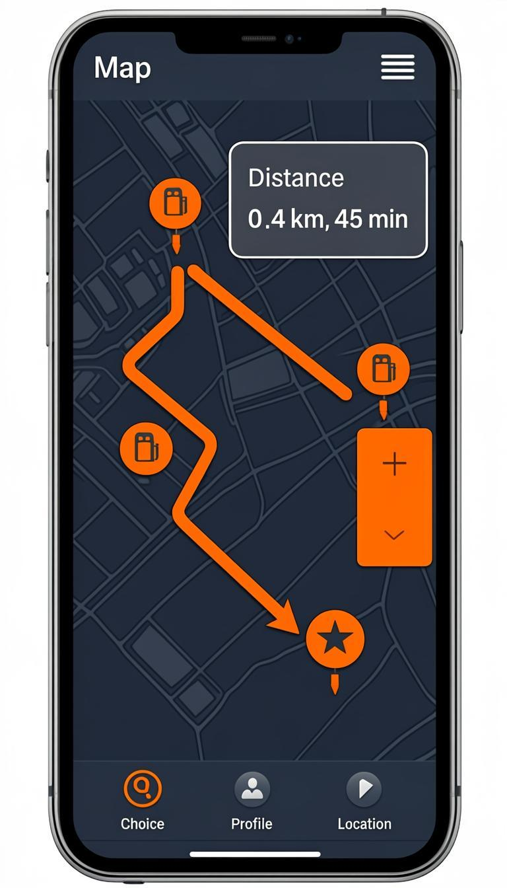
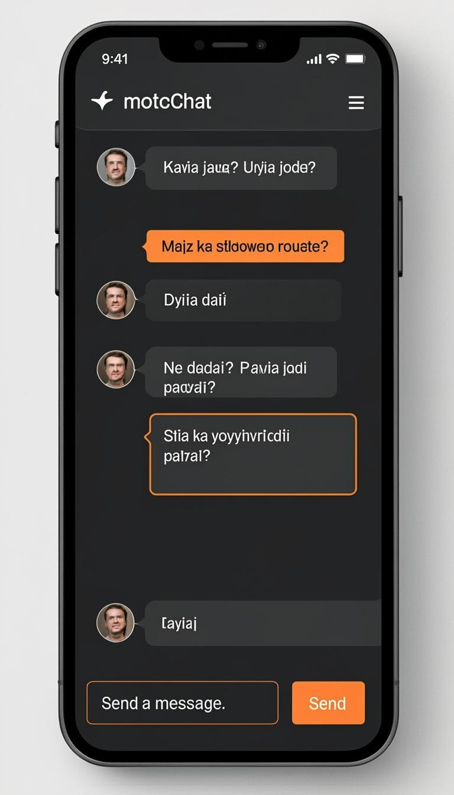
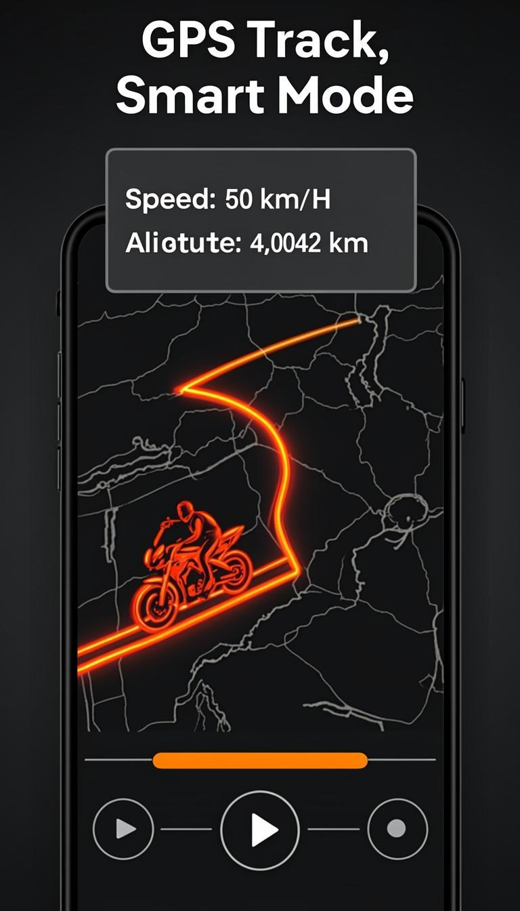
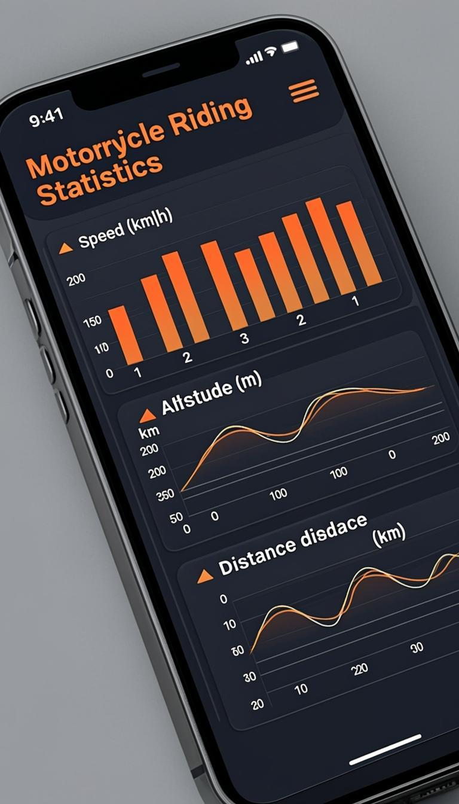
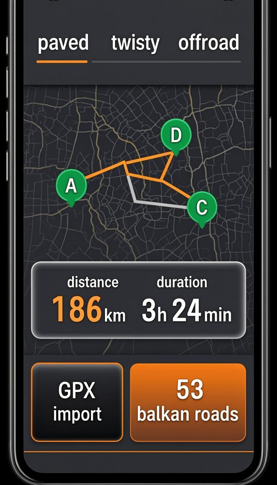
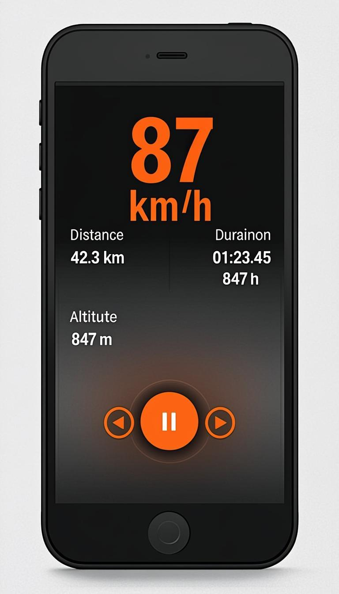
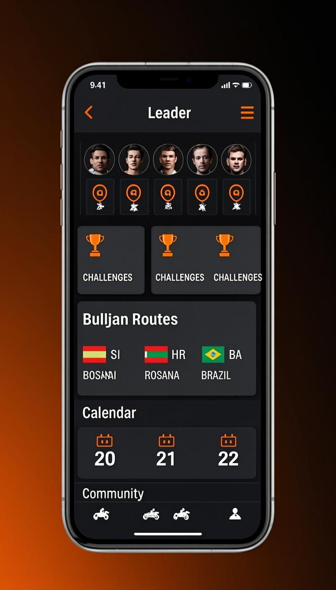
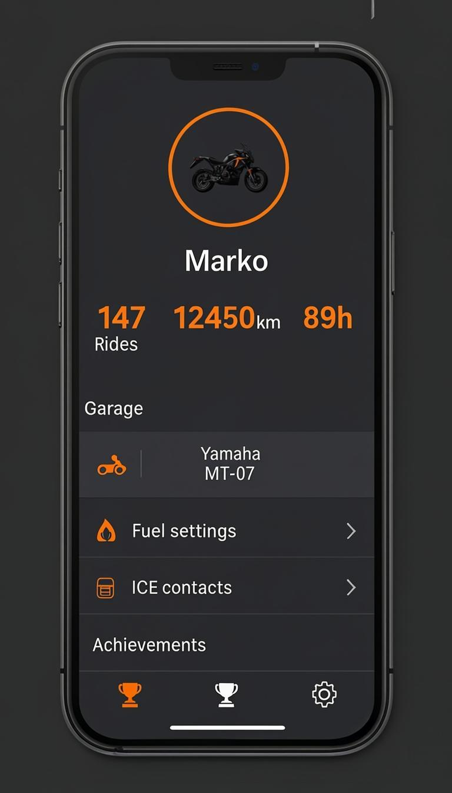

# 🏍️ MotoTrack — Odprtokodna GPS Aplikacija za Motoriste

<div align="center">

**Prva odprtokodna aplikacija za motoriste. Brezplačna. Zmeraj. Nikoli oglasov.**

[](LICENSE)
[](https://www.typescriptlang.org/)
[](https://nextjs.org/)
[](https://mototrack-gamma.vercel.app)
[](https://github.com/markec12345678/MotoTrack-)
[](https://mototrack-gamma.vercel.app)

[🌐 Demo](https://mototrack-gamma.vercel.app) · [🐛 Prijavi napako](https://github.com/markec12345678/MotoTrack-/issues) · [💡 Predlagaj funkcijo](https://github.com/markec12345678/MotoTrack-/issues)

</div>

---

## 🆓 Zakaj odprtokodna?

Motoristi na forumih (Reddit, ADVrider, SpyderLovers...) so jasni:

> *"I don't want any app. And especially your pay app."*
> *"Filled with ads, or charge you a monthly fee... And show ads."*
> *"The social part of riding apps is waste of their efforts"*
> *"$50/year is too much"*

MotoTrack je **odziv na te pritožbe**:

| Problem z obstoječimi aplikacijami | MotoTrack rešitev |
|---|---|
| 💰 REVER Pro stane $40/leto, Calimoto $50+/leto | ✅ **Brezplačna. Zmeraj.** |
| 📡 Ne veš kaj aplikacija počne s tvojimi podatki | ✅ **Odprta koda** — vsak lahko preveri |
| 📣 Oglasi in obvestila v aplikaciji | ✅ **Nikoli oglasov** — koda je odprta, vsak bi videl |
| 🔒 Podatki zaklenjeni v ekosistemu | ✅ **GPX izvoz kadarkoli** — tvoji podatki so tvoji |
| 💀 Aplikacija ugasnjena ker lastnik zapre posel | ✅ **Skupnost vzdržuje** — ne more se ugasniti |
| 🌍 Slaba podpora za Balkan | ✅ **Narejena za Balkan** — lokalna skupnost dodaja ceste in POI-je |
| 🤷 Ne moreš prispevati ali vplivati | ✅ **GitHub PR-ji** — vsak lahko izboljša |

---

## ⚡ Primerjava s konkurenco

| Funkcija | MotoTrack | REVER | Calimoto | Kurviger | OsmAnd |
|---|:---:|:---:|:---:|:---:|:---:|
| **Brezplačno** | ✅ | ⚠️ Pro=$40/leto | ⚠️ Pro=$50+/leto | ⚠️ Pro=€20/leto | ✅ | 
| **Odprta koda** | ✅ | ❌ | ❌ | ❌ | ✅ |
| **Vijugasto rutiranje** | ✅ | ⚠️ | ✅ | ✅ | ❌ |
| **Proaktivna glasovna nav.** | ✅ | ❌ | ⚠️ | ⚠️ | ❌ |
| **Driving Mode** | ✅ | ❌ | ❌ | ❌ | ❌ |
| **Crash detection** | ✅ | ❌ | ❌ | ❌ | ❌ |
| **Sledenje v živo** | ✅ | ⚠️ | ❌ | ❌ | ❌ |
| **Vreme ob poti** | ✅ | ❌ | ❌ | ❌ | ❌ |
| **Vzdrževanje motorja** | ✅ | ❌ | ❌ | ❌ | ❌ |
| **Sledenje stroškom** | ✅ | ❌ | ❌ | ❌ | ❌ |
| **3D pogled** | ✅ | ❌ | ❌ | ❌ | ❌ |
| **AI pomočnik** | ✅ | ❌ | ❌ | ❌ | ❌ |
| **Video sinhronizacija** | ✅ | ❌ | ❌ | ❌ | ❌ |
| **Prijave nevarnosti (Waze-style)** | ✅ | ❌ | ❌ | ❌ | ⚠️ |
| **Offline zemljevidi** | ✅ | ⚠️ Pro | ⚠️ Pro | ⚠️ Pro | ✅ |
| **GPX uvoz/izvoz** | ✅ | ✅ | ✅ | ✅ | ✅ |
| **Večdnevne ture** | ✅ | ❌ | ❌ | ❌ | ❌ |
| **Nagibni kot (Lean Angle)** | ✅ | ❌ | ❌ | ❌ | ❌ |
| **Balkanske ceste + ture** | ✅ (63+20) | ❌ | ❌ | ❌ | ❌ |
| **Deljenje rut s kodo + QR** | ✅ | ❌ | ❌ | ❌ | ❌ |
| **Offline predpomniljenje (SW v2)** | ✅ | ❌ | ❌ | ❌ | ⚠️ |
| **PC → Telefon (QR koda)** | ✅ | ⚠️ | ⚠️ | ⚠️ | ❌ |
| **Prednalaganje ploščic za ruto** | ✅ | ❌ | ❌ | ❌ | ⚠️ |
| **Napredna statistika (grafi)** | ✅ | ❌ | ❌ | ❌ | ❌ |
| **BT čelada → Glasovna nav.** | ✅ | ❌ | ❌ | ❌ | ❌ |
| **GPS ponovna vzpostavitev** | ✅ | ❌ | ❌ | ❌ | ❌ |
| **Vreme med vožnjo (dež/sneg opozorila)** | ✅ | ❌ | ❌ | ❌ | ❌ |
| **Kompas + ETA + hitrostni trend** | ✅ | ❌ | ❌ | ❌ | ❌ |
| **Ocene in mnenja o rutah** | ✅ | ⚠️ | ❌ | ❌ | ❌ |
| **Vzdrževalni opomniki (km/dnevi)** | ✅ | ❌ | ❌ | ❌ | ❌ |
| **Primerjava voženj (grafi)** | ✅ | ❌ | ❌ | ❌ | ❌ |
| **Skupnostne rute (brskanje, deljenje)** | ✅ | ❌ | ⚠️ | ❌ | ❌ |
| **Opozorila za bočni veter** | ✅ | ❌ | ❌ | ❌ | ❌ |
| **Nujna pomoč (državne številke)** | ✅ | ❌ | ❌ | ❌ | ❌ |
| **Počivališča ob ruti** | ✅ | ❌ | ❌ | ❌ | ⚠️ |
| **Kalkulator zahtevnosti** | ✅ | ❌ | ❌ | ❌ | ❌ |
| **Brez oglasov** | ✅ | ⚠️ Brezplačna verzija ima | ⚠️ | ✅ | ✅ |

> 💡 *Podatki o konkurenci pridobljeni iz forumov: Reddit r/motorcycles, r/NewRiders, r/MotoUK, ADVrider.com, SpyderLovers.com, App Store/Google Play reviews, 2024-2025*

---

## 🌟 Ključne funkcije

### 🗺️ Zemljevid
- Interaktivni zemljevid z Leaflet (2D) in MapLibre GL (3D pogled)
- Več stilov: ulice, satelit, teren, temno, topografsko, OSM
- Sloji: POI, nevarnosti, gorivo, parkirišča, v živo, kvaliteta cest, promet
- Plavajoče kartice z vožnjami in rutami
- 3D zemljevid z reliefnim prikazom
- Nočni način vožnje (rdeč filter za varnejšo vožnjo)

### 🛤️ Načrtuj pot
- Načrtovanje z waypointi na zemljevidu
- Tri načini: asfaltirano, vijugasto (Twisty), terensko (Off-road)
- **Twisty Route Generator** — samodejna vijugasta pot (najbolj iskana funkcija na forumih!)
- **Round Trip Generator** — prava krožna tura! Multi-waypoint algoritem z nastavljivo vijugavostjo: več intermediate točk za bolj zanimive rute (ne gre po isti cesti nazaj)
- GPX uvoz iz drugih aplikacij
- GPX izvoz in PDF izvoz poti
- **Deljenje rut s kodo + QR** — generiraj 6-mestno kodo (npr. MT3K7X) ALI QR kodo! Načrtuj na PC, skeniraj QR na telefonu —ruta se naloži samodejno. Podprta tudi Web Share API in kopiranje povezave
- **📱 Pošlji na telefon** — gumb za neposreden prenos rute iz Načrtuj na telefon (PC → telefon sinhronizacija)
- **Prednalaganje ploščic za ruto** — prednaloži zemljevidne ploščice vzdolž načrtovane rute za OFFLINE uporabo! Ključno za Balkan kjer je signal šibek. Prenesi pred vožnjo z WiFi, uporabljaj brez signala
- 53 kuriranih balkanskih cest
- Vreme ob poti — vremenski pogoji vzdolž celotne rute
- ROI analiza — ocena vrednosti poti (pokrajina, vijugavost, kvaliteta, vreme, gorivo, čas)

### ▶️ Sledi vožnji
- **Zanesljivo GPS sledenje** — WakeLock API + visibility change handler (ponovna vzpostavitev GPS ob vrnitvi iz ozadja), auto-save vsakih 15s v localStorage (crash recovery), GPS sanity check (zavrnitev skokov >500m, nizka natančnost), odporna obravnava napak (ne ustavi snemanja ob izgubi signala), **periodična ponovna vzpostavitev GPS** (vsakih 30s če watchPosition utihne — pogost Android PWA problem), sledenje višine iz GPS podatkov (samo vzpon), zaznavanje in označevanje GPS vrzeli (prepreči črte teleportacije na zemljevidu)
- Trenutna hitrost, razdalja, trajanje, višina, najvišja hitrost
- **Mini višinski profil v živo** — SVG vizualizacija sprememb nadmorske višine med vožnjo z gradient fill, trenutna višina, skupni vzpon/spust
- Samodejni premor (auto-pause) pri nizki hitrosti
- Wake Lock — zaslon ostane vklopljen med vožnjo
- **Glasna navigacija (TTS v slovenščini)** — PROAKTIVNA obvestila PRED zavoji ("Čez 200 metrov zavijte desno"), prilagojena razdalja obvestila glede na hitrost, navigacija po načrtovani ruti ali nazaj na začetek, predogled naslednjih korakov, zaznavanje izgube rute z gumbom za preračun, AI TTS ali brskalnikov TTS, **avtomatsko usmerjanje zvoka v BT čelado** (Sena, Cardo, Interphone...) — če je čelada povezana, navigacijska sporočila gredo v slušalnik čelade namesto v telefon! Majhna BT ikona (🎧) prikazuje stanje povezave
- Opozorila o hitrosti (nastavljiva meja, zvočni alarm)
- **Driving Mode v2** — poenostavljen celozaslonski vmesnik za vožnjo! Velika hitrost, navigacija, doseg goriva — varno za telefon na volanu (alternativa CarPlay/Android Auto za PWA). Novo: **kompas s smerjo** (DeviceOrientation API + GPS fallback), **ETA do cilja**, **trenutno ime ceste**, **hitrostni trend** (pospeševanje/zaviranje), izboljšan spodnji meni z gumbom za začetek/konec sledenja
- **Zaznavanje trčenja** — samodejno SOS ob trku + obvestilo ICE stikom
- **Crash recovery** — če app crashne ali gre v ozadje, podatki se obnovijo iz localStorage
- **Pre-Ride Checklist z vremenom** — pred vsako vožnjo preveri opremo IN vreme (nevarni pogoji blokirajo začetek vožnje!)
- Merjenje nagiba klanca (Lean Angle)
- Replay voženj — predvajanje preteklih voženj na zemljevidu
- 3D Replay — trodimenzionalni ogled vožnje
- Twistiness Score — ocena vijugavosti poti
- Touring Score — ocena primernosti za turizem
- Statistika voženj (Ride Stats Dashboard) — grafi in povzetki
- **Napredna statistika** — vizualni dashboard: tedenski pregled (stolpični diagram), mesečna aktivnost (površinski graf), distribucija hitrosti (krožni diagram), top rute, rekordi (najdaljša vožnja, najvišja hitrost, najdaljša serija)
- **Prijavljanje nevarnosti na cesti** — Waze za motoriste! Prijavi plaz, gradbišče, hitrostno kamero, poledico, poplavljeno cesto, živali, razlito olje, luknjo — hitro in enostavno med vožnjo. Prikaz bližnjih nevarnosti z razdaljo
- **Vreme med vožnjo (Weather Overlay)** — plavajoči vremenski pano med sledenjem! Temperatura, občutek, veter (smer + hitrost), vidljivost, vlažnost. **Sistem opozoril za dež/sneg**: samodejno zazna približujoč dež/sneg iz WMO kod, rumeno/rdeče opozorilo, zvočni alarm ob prvem zaznanju dežja (Web Audio API). Samodejna osvežitev vsakih 10 minut. Kompaktni način za Driving Mode

### 🧭 Raziskuj
- Vodilni položaji (Leaderboard)
- Izzivi (Challenges) s točkami in dosežki
- Skupnosti (5 motociklističnih skupnosti)
- 63 balkanskih cest z ocenami (10 držav)
- **20 vgrajenih balkanskih tur** — pripravljenih navigabilnih rut z waypointi (10 originalnih + 10 ikoničnih z GPS koordinatami!)
- **10 ikoničnih tur z GPS točkami in "Naloži v Načrtuj"** — Soška dolina & Vršič (120km), Crna Gora Loop: Kotor-Lovćen-Skadar (140km), Transfăgărășan Celotna (170km), Albanska riviera: Vlorë-Sarandë (150km), Rodopske gore: Pamporovo-Dospat (130km), **Pelješki polotok** (130km, Hrvaška), **Čabulja-Prenj gorska zanka** (110km, BiH), **Mavrovo-Debar soteska** (120km, Severna Makedonija), **Zlatibor-Tara narodni park** (140km, Srbija), **Meteora-Pind gorska ruta** (150km, Grčija). Kliknite "Naloži v Načrtuj" in ruta se naloži z dejanskimi GPS koordinatami za navigacijo!
- 17 motociklističnih dogodkov
- 15 moto-prijaznih kampingov
- Iskanje servisov in trgovin
- Socialni Feed — aktivnosti prijateljev
- Primerjava voženj (Compare Rides)
- Celozaslonski način
- **Skupnostne rute** — brskajte po rutah skupnosti, filtrirajte po kategoriji, težavnosti, razvrščajte po priljubljenosti. Naloži katerokoli ruto v Načrtuj z enim klikom!
- **Primerjava voženj** — vizualna primerjava dveh voženj s hitrostnim profilom (SVG), višinskim profilom, statistiko z zmagovalci in analizo segmentov (začetek/sredina/konec)
- **Ocene in mnenja o rutah** — ocenite ruto z zvezdami (1-5) po kategorijah: kakovost ceste, pokrajina, vijugavost, zahtevnost. Pišite komentarje, berite mnenja drugih
- **Vzdrževalni opomniki** — sledite vzdrževanju motorja z opomniki po kilometrih in dnevih: olje, pnevmatike, veriga, zavore, filter... Barvni indikatorji stanja (zeleni/rumeni/rdeči), zgodovina servisov
- **Opozorila za bočni veteran** — navzkrižni veteran je eden največjih nevarnosti za motoriste! MotoTrack samodejno izračuna bočni veteran iz smeri vožnje in smeri vetra. 4-stopenski sistem opozoril: zmeren/močan/nevaren. Zvočni alarm pri >40 km/h, rdeči utripajoči zaslon pri >60 km/h. Opozorilo za mostove (povečan veteran)
- **Nujna pomoč (Emergency Panel)** — hitri dostop do reševalnih številk za VSE balkanske države! Samodejno zazna državo iz GPS. Policija, reševalci, gasilci, 112. ICE stiki, deljenje lokacije, pomoč na cesti (HAK, AMZS, AMS...). Deluje BREZ interneta!
- **Počivališča ob ruti** — poiščite kavarnice, restavracije, razgledišča, bencinske črpeljke in počivališča vzdolž načrtovane rute. Dodaj kot waypoint z enim klikom
- **Kalkulator zahtevnosti vožnje** — samodejni izračun težavnosti iz 5 faktorjev: vzpon, nagib, razdalja, vijugavost, najvišja točka. Ocena: LAHKA/SREDNJA/TEŽKA/STROKOVNA

### 👤 Profil
- Osebni podatki in statistika
- **Nastavitve goriva** — rezervoar, poraba, doseg, trenutno gorivo
- **Pametna poraba** (Smart Consumption) — izračun dosega + opomnik za gorivo + Fuel Range Indicator med vožnjo (kako daleč lahko greš, iskanje najbližje bencinske, čas do praznega)
- **ICE stiki** (v sili) — krvna skupina, alergije, telefonske številke
- **Vzdrževanje in opomniki** — olje, pnevmatike, veriga, zavora, filter...
- **Sledenje stroškom** — gorivo, servis, zavarovanje, deli, cestnina, parkiranje
- Zasebne cone — skrivanje lokacije doma/sluzbe
- Seznam voženj in rut
- Priljubljene (Favorites) — shranjevanje za kasneje
- Večdnevna potovanja (Multi-day Trips)
- Garaža — upravljanje motornih koles
- Dosežki (Achievements) — gamifikacija
- Točke in ravni (Points & Levels)
- Ocenjevanje cest (Road Ratings)

### 🧠 AI pomočnik (MotoChat)
- AI klepet v slovenščini za načrtovanje poti
- Iskanje po spletu za aktualne informacije
- Vremenske napovedi in cestne razmere
- Predlogi rut in prelazov
- Predvožnjeni seznam (Pre-Ride Checklist) — AI-generirana kontrolna lista
- Vremenska primernost (Weather Suitability) — ocena ugodnosti za vožnjo

### 📊 Napredne funkcije
- **ROI analiza** — ocena vrednosti poti (pokrajina, vijugavost, kvaliteta, vreme, gorivo, čas)
- **Video sinhronizacija** — povezava GoPro/Action Cam posnetkov z GPS sledi
- **Live Tracking** — deljenje lokacije v realnem času z delilnim linkom
- **Offline sinhronizacija** — PWA podpora za delo brez interneta
- **Izboljšan Service Worker v2** — pametno predpomniljenje za offline delovanje (cache-first za statiko, network-first za API, stale-while-revalidate za zemljevide), ključno za Balkan kjer je signal šibek! Prikaže status predpomnilnika ob izgubi povezave
- **Deljne kartice voženj** — AI-generirane slike za socialna omrežja
- **Iskanje po vsem** (Global Search) — Ctrl+K za hitro iskanje
- **Obvestila** — zvonec z realno-časovnimi obvestili
- **SOS gumb** — enoprstitisk klic na pomoč z lokacijo
- **OBD povezava** — povezava z diagnostiko motornega kolesa
- **Bluetooth čelada** — upravljanje povezave s čelado
- **Prometna obvestila** — realno-časovni prometni podatki
- **Gorivo v bližini** — iskanje bencinskih servisov + cene goriva
- **Pametna priporočila** — AI-generirani predlogi poti
- **Gradientna analiza** — podroben višinski profil
- **Grupne vožnje** — organizacija skupinskih voženj s pridruževanjem
- **Prijatelji** — sistem prijateljev in sledenje
- **Kino (Cinema)** — predvajanje voženj kot animacijo
- **Nevarnosti na cesti** — Waze za motoriste (kamere, plazovi, gradbišča)
- **Cestne razmere** — ocene podlage (asfalt, makadam, pesek)
- **Servisi** — iskanje servisov in trgovin z deli

---

## 📸 Galerija

<p align="center">
  
  
  
  
  
  
  
  
</p>

---

## 🚀 Hitri začetek

### Namestitev

```bash
# Kloniraj repozitorij
git clone https://github.com/markec12345678/MotoTrack-.git
cd MotoTrack-

# Namesti odvisnosti
bun install

# Nastavi environment variables
cp .env.example .env
# Uredi .env s svojimi podatki

# Ustvari podatkovno bazo
bun run db:push

# Zaženi razvojni strežnik
bun run dev
```

### Environment Variables

```env
# Lokalni razvoj (SQLite)
DATABASE_URL=file:./db/custom.db

# Turso (produkcija na Vercelu)
TURSO_DATABASE_URL=libsql://your-db.turso.io
TURSO_AUTH_TOKEN=your-auth-token

# AI Klepet (neobvezno)
OPENROUTER_API_KEY=your-openrouter-key
```

### Deploy na Vercel

[](https://vercel.com/new/clone?repository-url=https://github.com/markec12345678/MotoTrack-)

1. Forknite repozitorij
2. Povežite z Vercel
3. Dodajte environment variables
4. Deploy! 🚀

---

## 🛠️ Tehnološki sklad

| Tehnologija | Namen |
|-------------|-------|
| **Next.js 16** | Ogrodje aplikacije (App Router) |
| **TypeScript 5** | Jezik s tipi |
| **Tailwind CSS 4** | Oblikovanje |
| **shadcn/ui** | UI komponente (New York style) |
| **Prisma ORM** | Dostop do podatkovne baze |
| **SQLite / Turso** | Podatkovna baza |
| **Leaflet** | 2D zemljevid |
| **MapLibre GL** | 3D zemljevid |
| **Socket.IO** | Realnočasovna komunikacija |
| **Recharts** | Grafi in diagrami |
| **Framer Motion** | Animacije |
| **Zustand** | Upravljanje stanja |
| **z-ai-web-dev-sdk** | AI funkcionalnosti (LLM, TTS, Image Gen, Web Search) |
| **PWA** | Namestitev kot aplikacija |

---

## 📱 PWA Namestitev

MotoTrack je **Progressive Web App** — deluje kot domača aplikacija na telefonu, brez App Store / Google Play.

### Android (Chrome)
1. Odprite MotoTrack v Chrome
2. Pritisnite ⋮ → **Dodaj na domači zaslon**

### iOS (Safari)
1. Odprite MotoTrack v Safari
2. Pritisnite Deli → **Na domači zaslon**

> 💡 PWA = brez 30% provizije App Store, brez cenzure, brez čakanja na odobritev

---

## 🤝 Prispevaj

MotoTrack je odprtokoden — **vsak prispevek je dobrodošel!**

### Kako lahko pomagaš:

- 🐛 **Prijavi napako** — [GitHub Issues](https://github.com/markec12345678/MotoTrack-/issues)
- 💡 **Predlagaj funkcijo** — Kaj pogrešaš kot motorist?
- 🗺️ **Dodaj balkansko cesto** — Poznaš dobro cesto? Dodaj jo!
- 🌍 **Prevajaj** — Dodaj podporo za hrvaščino, srbščino, albanščino...
- 🎨 **Oblikuj** — Izboljšaj UI/UX
- 💻 **Kodiraj** — Poišči `good first issue` in pošlji PR

### Razvojni koraki:

```bash
# 1. Fork + kloniraj
git clone https://github.com/YOUR_USERNAME/MotoTrack-.git

# 2. Ustvari branch
git checkout -b feature/moja-nova-funkcija

# 3. Kodiraj + testiraj
bun run dev

# 4. Commit + push
git commit -m "✨ Dodaj mojo novo funkcijo"
git push origin feature/moja-nova-funkcija

# 5. Odpri Pull Request
```

---

## 📂 Struktura projekta

```
src/
├── app/
│   ├── page.tsx          # Glavna stran
│   ├── layout.tsx        # Root layout (theme, PWA, error boundary)
│   ├── globals.css       # Globalni stili
│   └── api/              # 110 API končnih točk
│       ├── achievements/    # Dosežki in gamifikacija
│       ├── balkan-roads/    # Kurirane balkanske ceste
│       ├── bluetooth/       # Bluetooth čelada
│       ├── camps/           # Kampi za motoriste
│       ├── challenges/      # Izzivi
│       ├── chat/            # AI klepet (LLM)
│       ├── cinema/          # Predvajanje voženj
│       ├── comments/        # Komentarji
│       ├── communities/     # Skupnosti
│       ├── compare/         # Primerjava voženj
│       ├── crash-detection/ # Zaznavanje trčenja
│       ├── emergency-contacts/ # ICE stiki
│       ├── events/          # Motociklistični dogodki
│       ├── expenses/        # Sledenje stroškom
│       ├── favorites/       # Priljubljene
│       ├── feed/            # Socialni Feed
│       ├── friends/         # Prijatelji
│       ├── fuel/            # Gorivo in poraba
│       ├── fuel-prices/     # Cene goriva
│       ├── gpx/             # GPX uvoz/izvoz/PDF
│       ├── group-rides/     # Grupne vožnje
│       ├── hazards/         # Nevarnosti na cesti
│       ├── leaderboard/     # Vodilni položaji
│       ├── lean-angle/      # Nagib klanca
│       ├── live-tracking/   # Live tracking
│       ├── maintenance/     # Vzdrževanje
│       ├── map-styles/      # Stili zemljevida
│       ├── navigation/      # Turn-by-turn navigacija
│       ├── notifications/   # Obvestila
│       ├── obd/             # OBD diagnostika
│       ├── offline-maps/    # Offline zemljevidi
│       ├── offroad-route/   # Terenske poti
│       ├── parking/         # Parkirišča
│       ├── photos/          # Fotografije
│       ├── points/          # Točke in ravni
│       ├── pois/            # Zanimive točke
│       ├── privacy-zones/   # Zasebne cone
│       ├── ride-animation/  # Animacija voženj
│       ├── ride-card/       # Generiranje deljnih kartic
│       ├── ride-score/      # Ocena voženj
│       ├── rides/           # CRUD za vožnje
│       ├── road-conditions/ # Cestne razmere
│       ├── road-ratings/    # Ocene cest
│       ├── round-trip/      # Krožna tura
│       ├── route-recommendations/ # Priporočila rut
│       ├── route-roi/       # ROI analiza rut
│       ├── routes/          # CRUD za rute
│       │   └── share/       # Deljenje rut s kodo (MT3K7X)
│       ├── seed/            # Seed podatki
│       ├── service-centers/ # Servisi
│       ├── services/        # Iskanje servisov
│       ├── settings/        # Nastavitve
│       ├── share/           # Deljenje
│       ├── smart-consumption/ # Pametna poraba
│       ├── sos/             # SOS klic na pomoč
│       ├── speed-settings/  # Nastavitve hitrosti
│       ├── stats/           # Statistika
│       ├── subscription/    # Naročnina (prosti del)
│       ├── sync-queue/      # Offline sinhronizacija
│       ├── touring-score/   # Touring Score
│       ├── traffic/         # Promet
│       ├── trips/           # Večdnevna potovanja
│       ├── tts/             # Besedilo v govor
│       ├── twisty-route/    # Vijugasta pot
│       ├── user/            # Trenutni uporabnik
│       ├── users/           # Uporabniki
│       ├── videos/          # Video posnetki
│       ├── weather/         # Vremenski podatki
│       ├── weather-alerts/  # Vremenska opozorila
│       ├── weather-along-route/ # Vreme ob poti
│       └── web-search/      # Iskanje po spletu
├── components/
│   ├── tabs/                # Zavihki (Zemljevid, Načrtuj, Sledi, Raziskuj, Profil)
│   ├── features/           # Funkcijski panoji
│   ├── moto-map.tsx        # Interaktivni zemljevid
│   ├── moto-chat.tsx       # AI klepet komponenta
│   ├── home.tsx            # Glavna komponenta
│   └── ui/                 # shadcn/ui komponente
├── hooks/                  # React hooks (use-settings, use-debounce, use-mobile)
├── lib/                    # Utility funkcije (db, utils, offline-protocol, notifications)
└── ...
```

---

## 🗄️ Podatkovna baza

42 Prisma modelov za popolno funkcionalnost:

| Model | Namen |
|-------|-------|
| User | Uporabniki z nastavitvami, ICE, gorivo, hitrost |
| Ride | GPS vožnje s track podatki |
| Route | Načrtovane poti z waypointi |
| Comment | Komentarji na vožnje/rute |
| Like | Všečki na rutah |
| Poi | Zanimive točke |
| Achievement | Dosežki |
| Community | Skupnosti |
| CommunityMember | Člani skupnosti |
| Hazard | Nevarnosti na cesti |
| Friendship | Prijatelji |
| Notification | Obvestila |
| SosAlert | SOS klici |
| Photo | Fotografije |
| RoadRating | Ocene cest |
| Trip | Večdnevna potovanja |
| TripDay | Dnevi potovanja |
| Expense | Stroški (gorivo, servis, zavarovanje...) |
| MaintenanceReminder | Opomniki vzdrževanja |
| GroupRide | Grupne vožnje |
| GroupRideParticipant | Udeleženci |
| LiveTrackingSession | Live tracking seje |
| LiveTrackingViewer | Ogledovalci |
| CrashEvent | Trki (g-force, hitrost, lokacija) |
| LeanAngleSession | Nagib seje |
| GpxImport | GPX uvozi |
| Challenge | Izzivi |
| ChallengeParticipant | Udeleženci izzivov |
| MapStyleConfig | Nastavitve zemljevida |
| ServiceCenter | Servisi in trgovine |
| UserPoints | Točke uporabnikov |
| PointsTransaction | Transakcije točk |
| Favorite | Priljubljene |
| SocialActivity | Socialni Feed |
| ActivityLike | Všečki na Feed |
| OfflineMap | Offline zemljevidi |
| PrivacyZone | Zasebne cone |
| MotoEvent | Motociklistični dogodki |
| CampSite | Kampi |
| VideoFootage | Video posnetki |
| VideoHighlight | Video izseki |
| RouteRoiScore | ROI ocene |
| OfflineSyncQueue | Offline sinhronizacija |

---

## 🌍 Balkanske ceste & Ture

63 kuriranih motociklističnih cest po 10 državah + **20 vgrajenih turnih rut** (10 originalnih + 10 ikoničnih z GPS točkami):

### Vgrajene ture (naloži in pelji!)
- 🇸🇮 **Prelaz Vršič & Soška dolina** — 85 km, 50 serpentín, 9.5/10
- 🇸🇮 **Jadranska obala** — 95 km, sproščujoča obalna ruta
- 🇸🇮 **Jezersko & Pokljuka** — 70 km, gorski prelazi in gozdne ceste
- 🇭🇷 **Gorski Kotar** — 120 km, gozdne ceste in jezera
- 🇭🇷 **Jadranska magistrala** — 180 km, legendarne obalna cesta
- 🇲🇪 **Kotor serpentine** — 45 km, 25 ozkih serpentín (10/10!)
- 🇷🇴 **Transfăgărășan** — 150 km, Top Gearjeva najljubša cesta
- 🇷🇴 **Transalpina** — 140 km, najvišja cesta v Romuniji (2145m)
- 🇦🇱 **SH8 Obala** — 130 km, albanska riviera
- 🇧🇬 **Prelaz Šipka** — 110 km, Dolina vrtnic

### 🌟 Ikonične ture z GPS točkami (naloži v Načrtuj!)
- 🇸🇮 **Soška dolina & Vršič Full Loop** — 120 km, 12 GPS točk, Tolmin→Kobarid→Bovec→Vršič→Kranjska Gora→Trenta→Bovec, 9.8/10
- 🇲🇪 **Crna Gora Loop: Kotor-Lovćen-Skadar** — 140 km, 12 GPS točk, Kotor serpentine→Lovćen→Cetinje→Skadar→Budva, 9.9/10
- 🇷🇴 **Transfăgărășan Celotna** — 170 km, 11 GPS točk, Băile Olănești→Curtea de Argeș→Bâlea Lake (2034m)→Sibiu, 10/10
- 🇦🇱 **Albanska riviera: Vlorë-Sarandë** — 150 km, 11 GPS točk, Vlorë→Llogara (1027m)→Dhërmi→Himarë→Sarandë→Ksamil, 9.2/10
- 🇧🇬 **Rodopske gore: Pamporovo-Dospat** — 130 km, 11 GPS točk, Pamporovo→Shiroka Laka→Devin→Yagodina jama→Trigrad→Dospat, 9.1/10
- 🇭🇷 **Pelješki polotok** — 130 km, 12 GPS točk, Ston→Mali Ston→Dingač→Trstenik→Orebić→Lovište, 8.8/10
- 🇧🇦 **Čabulja-Prenj gorska zanka** — 110 km, 12 GPS točk, Mostar→Blagaj→Čabulja→Konjic→Jablanica, 9.0/10
- 🇲🇰 **Mavrovo-Debar soteska** — 120 km, 12 GPS točk, Skopje→Tetovo→Mavrovo jezero→Debar→Radika soteska, 8.9/10
- 🇷🇸 **Zlatibor-Tara narodni park** — 140 km, 12 GPS točk, Užice→Zlatibor→Mokra Gora→Tara→Bajina Bašta, 9.1/10
- 🇬🇷 **Meteora-Pind gorska ruta** — 150 km, 12 GPS točk, Kalambaka→Meteora→Pind prehod→Metsovo→Ioannina, 9.5/10

### Ceste po državah

- 🇸🇮 **Slovenija** — Vršič, Soška dolina, Obala, Pohorje, Jezersko, Pokljuka
- 🇭🇷 **Hrvaška** — Jadranska magistrala, Gorski kotar, Lika, Pelješac
- 🇧🇦 **BiH** — Čabulja, Prenj, Vlašić
- 🇲🇪 **Črna gora** — Lovćen, Durmitor, Piva, Kotor serpentine
- 🇷🇸 **Srbija** — Zlatibor, Tara, Kopaonik
- 🇲🇰 **Severna Makedonija** — Ohrid, Mavrovo
- 🇦🇱 **Albanija** — SH8 obala, Valbona, Theth
- 🇧🇬 **Bolgarija** — Trakijski prelazi, Rila, Rodopi
- 🇷🇴 **Romunija** — Transfăgărășan, Transalpina, Transbucegi
- 🇬🇷 **Grčija** — Meteora, Pindos

> 🗺️ Poznaš dobro cesto, ki je ni na seznamu? [Dodaj jo!](https://github.com/markec12345678/MotoTrack-/issues)

---

## 🗺️ Kaj motoristi pogrešajo (raziskava forumov)

Raziskali smo več kot 15 forumov (Reddit, ADVrider, SpyderLovers, itd.) in zbrali, kaj motoristi pogrešajo pri obstoječih aplikacijah. MotoTrack že pokriva večino:

| Kaj motoristi želijo | MotoTrack |
|---|:---:|
| Vijugasto rutiranje (twisty roads) | ✅ |
| Zanesljivo GPS sledenje (z visibility handler) | ✅ |
| Offline zemljevidi | ✅ |
| GPX uvoz/izvoz | ✅ |
| Crash detection + SOS | ✅ |
| Sledenje v živo | ✅ |
| Iskanje goriva + opomniki | ✅ |
| Krožne ture (multi-waypoint loop) | ✅ |
| Vreme ob poti | ✅ |
| Evidence vzdrževanja | ✅ |
| Proaktivna glasovna navigacija (PRED zavoji!) | ✅ |
| Skupinsko sledenje | ✅ |
| Izbegovanje nevarnih cest | ✅ |
| Zaznavanje izgube rute + preračun | ✅ |
| GPS sanity check (zavrnitev glitch-ov) | ✅ |
| Driving Mode (celozaslonski vmesnik za vožnjo) | ✅ |
| CarPlay / Android Auto | 🔜 Načrtovano |
| PC → Telefon (QR koda) | ✅ |

### 🔥 Najnovejše izboljšave (forum-driven)

Glede na raziskavo forumov (Reddit r/motorcycles, ADVrider, SpyderLovers, itd.) smo izboljšali:

1. **Proaktivna glasovna navigacija** — MOTORISTI NA FORUMIH SO JASNI: "It literally just displays the route line, without providing vocal direction" (REVER). Zato MotoTrack zdaj naznani zavojne PREDEN prideš do njih: "Čez 200 metrov zavijte desno na Ulica X". Razdalja obvestila se prilagaja hitrosti (500m pri >100km/h, 150m pri mestni vožnji).

2. **Odporno GPS sledenje** — Forumi: "Problems with the ride tracking feature. It does run in the background even if you close the app" (REVER). Zato MotoTrack zdaj: visibility change handler (obnovi WakeLock + GPS ob vrnitvi iz ozadja), GPS sanity check (zavrne skoke >500m), zavrača natančnost <200m, auto-save vsakih 15s (ne 30s), ne ustavi snemanja ob napaki GPS.

3. **Izboljšan krožni algoritem** — Kurviger forum: "Specify a round trip and how long and how curvy the roads". Zato MotoTrack zdaj uporablja multi-waypoint loop z 2-4 intermediate točkami, ne več samo trikotnika. Višja vijugavost = več točk + širši odmik od direktne poti.

4. **Zaznavanje izgube rute** — Če zapustiš načrtovano pot, MotoTrack zazna in ponudi gumb "Preračunaj ruto".

5. **Driving Mode** — Forumi: "My phone does not go anywhere near my handlebars" (Kurviger). Motoristi, ki imajo telefon na volanu, potrebujejo poenostavljen vmesnik. MotoTrack zdaj ponuja Driving Mode: velika hitrost (140px!), naslednji zavoj z razdaljo, doseg goriva, samodejni kompaktni način pri visoki hitrosti, GPS natančnost in baterija — vse na črnem ozadju z minimalnim motnjem.

6. **QR koda za PC → Telefon** — Forumi: "I want to plan routes on my computer and then ride them" (REVER, Calimoto, Kurviger imajo web planner). MotoTrack zdaj generira QR kodo za vsako ruto — načrtuj na PC, skeniraj QR na telefonu in ruta se samodejno naloži! Tudi 6-mestna koda za deljenje po SMS/WhatsApp.

7. **Prednalaganje ploščic za ruto** — Forumi: "Offline maps are essential" (ADVrider). MotoTrack zdaj omogoča prednalaganje zemljevidnih ploščic vzdolž načrtovane rute pred vožnjo. Prenesi z WiFi doma, uporabljaj brez signala v gorah! Zoom nivoji 10-15, buffer 5km okoli rute.

8. **Napredna statistika** — Vizualni dashboard s stolpičnimi diagrami (tedenski pregled), površinskimi grafi (mesečna aktivnost), krožnim diagramom (distribucija hitrosti), top rutami in rekordi.

9. **BT čelada → Glasovna navigacija** — Ko je Bluetooth čelada (Sena, Cardo, Interphone, Midland...) povezana, se navigacijska sporočila SAMODEJNO usmerijo v slušalnik čelade. Skupni hook `useBtAudio` preveri stanje povezave in glasnost. Majhna BT ikona (🎧) v vmesniku prikazuje, da je zvok usmerjen v čelado. Brez čelade = vse deluje enako kot prej (100% združljivo nazaj).

10. **GPS ponovna vzpostavitev (re-acquisition)** — Pogost problem na Android PWA: `watchPosition` utihne, ko app gre v ozadje. MotoTrack zdaj vsakih 30s preveri, ali je prišel nov GPS podatek — če ne, samodejno zahteva nov položaj z `getCurrentPosition()`. Ob vrnitvi iz ozadja se takoj pridobi nov GPS fix in prikaže obvestilo o času prekinitve (npr. "Nazaj po 5 min — nadaljujem sledenje"). GPS vrzeli (>30s) se označijo s sentinelno vrednostjo, da preprečijo črte "teleportacije" na zemljevidu. Višina se zdaj pridobiva iz GPS podatkov (samo pozitivne spremembe = vzpon).

11. **Vreme med vožnjo z opozorili za dež/sneg** — Forumi: "Weather warnings while riding are critical" (ADVrider). MotoTrack zdaj prikazuje plavajoči vremenski pano med sledenjem s temperaturo, vetrom, vidljivostjo. Ko se približuje dež ali sneg, se prikaže rumeno/rdeče opozorilo "🌧️ Dež v bližini!" z zvočnim alarmom. Podatki se osvežujejo vsakih 10 minut. Kompaktni način za Driving Mode.

12. **Driving Mode v2 s kompasom, ETA in hitrostnim trendom** — Forumi: "Need to know which direction I'm heading and when I'll arrive" (Kurviger). MotoTrack zdaj ponuja kompas (DeviceOrientation API), ETA do cilja (izračun iz hitrosti + preostale razdalje), ime trenutne ceste iz navigacije in indikator pospeševanja/zaviranja. Izboljšan spodnji meni z gumbom za začetek/konec sledenja.

13. **10 ikoničnih balkanskih tur z GPS koordinatami** — Forumi: "Show me the best roads, not just any road" (REVER, Calimoto). MotoTrack zdaj ponuja 10 ikoničnih tur z dejanskimi GPS koordinatami (vsaka z 12 točkami): Vršič, Kotor serpentine, Transfăgărășan, Albanska riviera, Rodopi, **Pelješki polotok** (Hrvaška), **Čabulja-Prenj** (BiH), **Mavrovo-Debar** (Severna Makedonija), **Zlatibor-Tara** (Srbija), **Meteora-Pind** (Grčija). Vsaka ruta ima gumb "Naloži v Načrtuj" za takojšnjo navigacijo!

14. **Ocene in mnenja o rutah** — Forumi: "I want to know if a road is worth riding before I go" (REVER, Calimoto). MotoTrack zdaj omogoča ocenjevanje rut z zvezdami (1-5) po kategorijah: kakovost ceste, pokrajina, vijugavost, zahtevnost. Pišite komentarje in berite mnenja drugih motoristov. Povprečna ocena s porazdelitvijo zvezd.

15. **Vzdrževalni opomniki po kilometrih/dnevih** — Forumi: "I need maintenance reminders based on mileage" (ADVrider). MotoTrack zdaj ponuja celovit sistem vzdrževanja: opomniki za olje, pnevmatike, verigo, zavore, filter z intervali v km in dnevih. Barvni indikatorji (zeleni >50%, rumeni 25-50%, rdeči <25%) in zgodovina servisov.

16. **Skupnostne rute — brskajte in delite** — Forumi: "I want to discover routes from other riders" (Kurviger, REVER). MotoTrack zdaj ponuja ploščo skupnostnih rut s filtrom po kategoriji, težavnosti, razvrščanjem po priljubljenosti/času/razdalji. Vsaka ruta ima gumb "Naloži v Načrtuj" za takojšnjo navigacijo. Lajkanje rut in preklapljanje med skupnostjo in mojimi rutami.

17. **Primerjava voženj z vizualnimi grafi** — Forumi: "I want to compare my rides visually" (Strava). MotoTrack zdaj ponuja vizualno primerjavo dveh voženj: hitrostni profil (SVG), višinski profil z obarvanimi površinami, statistika z zmagovalci (🏆) in analiza segmentov (začetek/sredina/konec tretjine).

18. **Opozorila za bočni veter** — Forumi: "Crosswind is terrifying on a motorcycle" (Reddit r/motorcycles). MotoTrack zdaj samodejno izračuna bočni veter iz smeri vožnje in smeri vetra. 4-stopenski sistem: zmeren (20-40 km/h), močan (40-60 km/h, zvočni alarm), nevaren (>60 km/h, rdeči utripajoči zaslon, "USTAVI SE!"). Opozorilo za mostove z povečanim vetrom. Napoved vetra za 3 dni.

19. **Nujna pomoč z državnimi številkami** — Forumi: "I ride across borders and don't know the local emergency numbers" (ADVrider). MotoTrack zdaj ponuja hitri dostop do reševalnih številk za VSE 10 balkanskih držav. Samodejno zazna državo iz GPS. Policija, reševalci, gasilci, EU 112. ICE stiki s krvno skupino, deljenje lokacije, pomoč na cesti (HAK, AMZS, AMS...). **Deluje brez interneta!**

20. **Počivališča ob ruti in kalkulator zahtevnosti** — Forumi: "I need to know where to stop and how hard the route is" (REVER, Calimoto). MotoTrack zdaj ponuja iskanje počivališč (kavarnice, restavracije, razgledišča) vzdolž načrtovane rute z dodajanjem kot waypoint. Samodejni kalkulator zahtevnosti iz 5 faktorjev (vzpon, nagib, razdalja, vijugavost, najvišja točka) oceni ruto kot LAHKA/SREDNJA/TEŽKA/STROKOVNA.

---

## ❓ Pogosta vprašanja

**Ali je MotoTrack brezplačen?**
Da, vse funkcije so brezplačne. Brez naročnine, brez oglasov, brez plačljivih funkcij. Za vedno — koda je odprta.

**Ali deluje brez interneta?**
Da, kot PWA aplikacija deluje tudi offline. Spremembe se sinhronizirajo ob ponovni povezavi.

**Ali lahko uvozim GPX datoteke?**
Da, v zavihku Načrtuj kliknite GPX uvoz. Podprt je tudi izvoz in PDF.

**Kako deluje AI pomočnik?**
MotoChat uporablja veliki jezikovni model za odgovarjanje v slovenščini. Lahko išče tudi po spletu za aktualne informacije.

**Kako deluje SOS gumb?**
SOS gumb pošlje lokacijo in obvestilo ICE stikom. Ob trku se aktivira samodejno (crash detection).

**Ali podpira več motornih koles?**
Da, v Garaži lahko upravljate več motornih koles z nastavitvami za vsako.

**Zakaj odprtokodna?**
Ker motoristi zaslužijo aplikacijo, ki je njihova — ne korporacij. Brez skritih sledilnikov, brez nenadnih naročnin, brez tveganja, da bo aplikacija ugasnjena. Odprta koda = transparentnost = zaupanje.

**Ali lahko hostam na svojem strežniku?**
Da! MotoTrack lahko poganjaš na lastnem strežniku z `bun run dev` ali na Vercelu. Tvoji podatki, tvoj strežnik.

---

## ❤️ Podpri projekt

MotoTrack je brezplačen in odprtokoden. Če ti aplikacija pomaga, lahko podpreš razvoj z:

- ⭐ **Zvezdica na GitHubu** — najlažji način za podporo!
- 🍴 **Fork + PR** — prispevaj kodo
- 🗺️ **Dodaj cesto/POI** — izboljšaj podatke za Balkan
- 🌍 **Prevajaj** — dodaj jezik
- 💰 [GitHub Sponsors](https://github.com/sponsors/markec12345678)
- ☕ [Buy Me a Coffee](https://www.buymeacoffee.com/markec)
- 📢 Deli aplikacijo s prijatelji motoristi 🏍️

---

## 📄 Licenca

MIT License — uporabljaj, spreminjaj, delaj kar hočeš. Samo ne pozabi na zasluge.

---

<div align="center">

**MotoTrack — Odprtokodna aplikacija za motoriste.**
*Brezplačna. Transparentna. Za vedno.*

🏍️ Zgrajen z ❤️ za balkanske motoriste · Made by [Markec](https://github.com/markec12345678)

</div>
